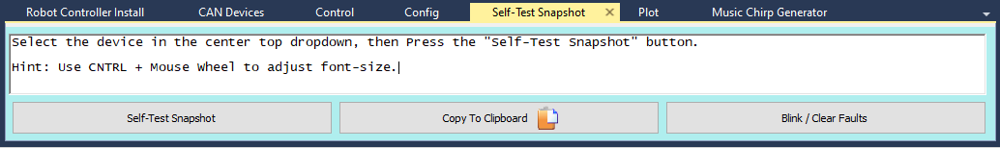

# Using Motion Magic

## Overview

- The official Motion Magic documentation can be found [here](https://docs.ctre-phoenix.com/en/stable/ch16_ClosedLoop.html).
- Motion Magic is an extended version of PID that allows for a motor to quickly move to and maintain a position.

## Initial Setup

- Motion Magic movement is based on 4 constants: 
    - **kP, kI, kD, and kF**
    - These drive the main PIDF loop used in Motion Magic
    - **kF** most drastically affects the movement, while kI is usually not used.
    - See PID article for more information

- **kF** must be tuned before usage.
    - Can be roughly calculated through the velocity of the motor.

### Calculating kF

1. Open Phoenix Tuner and connect to the robot.

2. Select the motor to tune with Motion Magic in the dropdown

3. Open the Config tab and set the kP, kI, kD, and kF values to 0.

4. Open the Control tab and set the motor to a velocity close to the speed that it will operate when using Motion Magic in percent input mode.

    - Record the percent input that the motor is running at.

```{warning} Safety Protocols
Remember to do the standard procedure of enabling the robot, calling clear, etc. before running the motor.
```

5. Switch to the Self-test Snapshot tab and click on the self-test snapshot button.

    - Record the units per 100 ms.



6. Calculate kF using:

    kF = percent input * 1023 / units per 100 ms

    - For example, if the motor outputs 2000 units per 100 ms at 25% voltage:
        kF=0.25*1023/2000=0.127875

7. Record your kF in the code as a constant in the constants class. For example:

.. code-block:: java
    :linenos:
    
    package frc.robot;

    public final class Constants {
        public static final class ArmConstants {
            public static final double kMotorkF = 0.015;
        }
    }

- Record the other constants in the constants file in the same way.
- The other constants can be tuned manually, but do not have a defining equation.
    - Official CTRE documentation for this can be found [here](https://docs.ctre-phoenix.com/en/stable/ch16_ClosedLoop.html#dialing-kp).

### Applying Constants

- The constants can be applied with the methods ```motorName.config_kP(slot, kP)```, ```motorName.config_kI(slot, kI)```, etc.
    - The slot is an int that represents which PIDF configuration slot the values are saved to. Make sure to use one that is not occupied by other motors.

.. code-block:: java

    motorName.config_kP(0, Constants.kMotorkP);
    motorName.config_kI(0, Constants.kMotorkI);
    motorName.config_kD(0, Constants.kMotorkD);
    motorName.config_kF(0, Constants.kMotorkF);


## Calculating positions

1. Display the position (in ticks) of the motor through SmartDashboard.
    - Can also be logged, but this is easier

.. code-block:: java

    SmartDashboard.putNumber("Motor Position", masterMotor.getSelectedSensorPosition());

1. Enable the robot and rotate the motor by hand to the starting position.
    - Record the position in ticks.

1. Rotate the motor to the next position, and record the position in ticks.

1. Calculate and record the difference in position in ticks.
    - Subtract the first position from the second position
    - This will be the amount of ticks the motor needs to move by.
    - If possible, a protractor can also be used to measure the physical angle between the two positions, which can be used to find how many ticks are in an angle.

## Setting Cruise Velocity and Acceleration

- Motors running on Motion Magic will attempt to move at the cruise velocity before slowing down and reaching their destination, and accelerate at the acceleration speed.
    - The cruise velocity can be set with ```motorName.configMotionCruiseVelocity()```.
        - Takes a double that represents the number of ticks per 100 ms, or 10x the amount of ticks to rotate per second.
        - This value should be initially set lower than desired, and increased to fit the required speed. 
            - It can also be calculated from the angular velocity by using the ticks to angle conversion calculated earlier.
    - The acceleration can be set with ```motorName.configMotionAcceleration()```
        - Takes a double that represents the number of ticks per 100 ms per one second, or how much the motor velocity increases per second.
        - If set to the same value as the cruise velocity, it will take 1 whole second to reach cruise velocity.
    - These values can be manually changed later to fit requirements.

## Running Motion Magic in Code

- Motion Magic is run with the method ```motorName.set(ControlMode.MotionMagic, outputValue)```
    - outputValue is the position in ticks that the motor should move to.
    - outputValue should be the current position plus the target position.
        - For example, to move by 1000 ticks: 
        - ```motorName.set(ControlMode.MotionMagic, motorName.getSelectedSensorPosition() + 1000)```
    
- A method to move the motor using Motion Magic can also be created, such as:

.. code-block:: java

    public void motionMagicMove(double ticksToTarget) {
        motorName.set(ControlMode.MotionMagic, motorName.getSelectedSensorPosition() + ticksToTarget);
    } 

- This method can then be used inside an InstantCommand as a lambda to run it as a command.

.. code-block:: java
    
    InstantCommand move1000Ticks = new InstantCommand(() -> {
        subsystemName.motionMagicMove(1000)
    });

    move1000Ticks.schedule()

