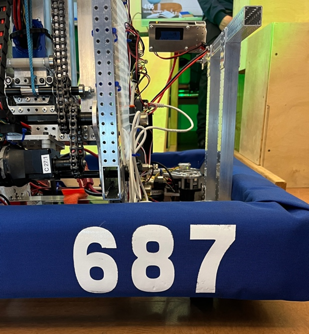
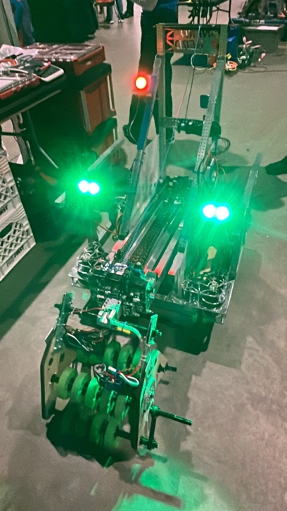
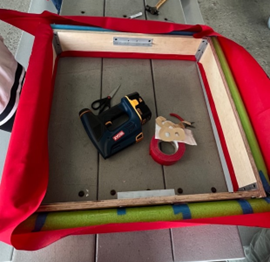
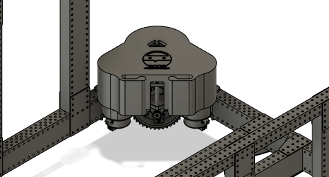
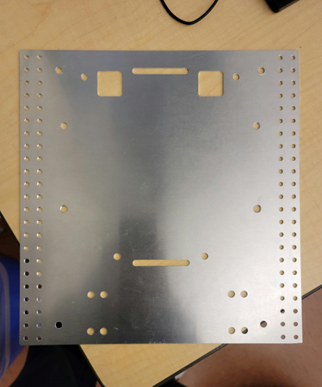
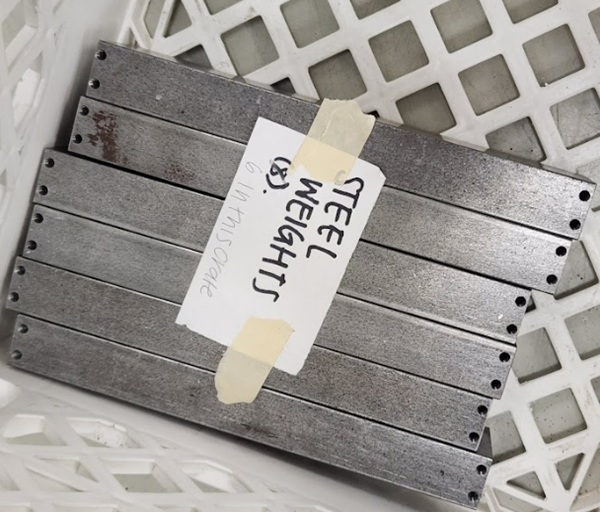
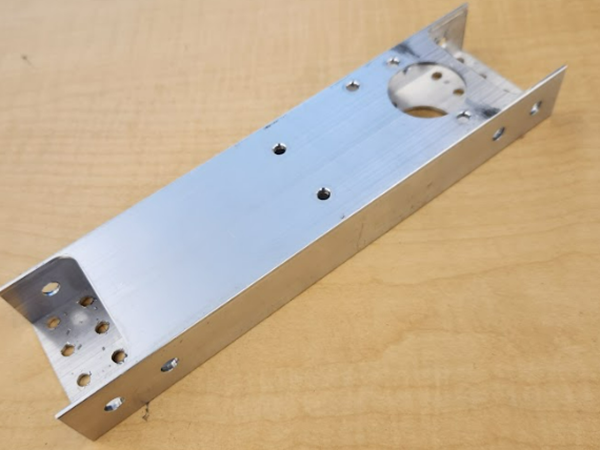
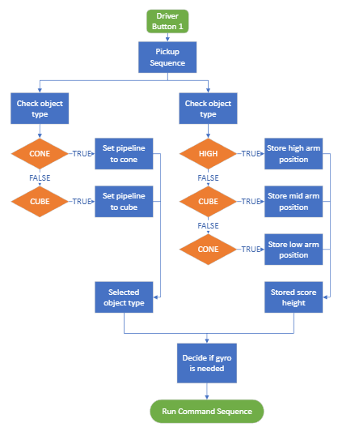

# Week 7 (2/19 - 2/25)

## Assembly

### 2/20 Monday 

Pneumatics 
- Organized new pneumatics 

Battery 
- Attempted to fix portable battery charger 

Electrical 
- Checked on the robot’s electrical components 
- Tested the navX 

Mechanical 
- Installed hardstops for rotation 

Swerve  
- Checked swerve modules 
- Created documentation for swerve module checkup 

Bumpers 
- Fixed the bumper numbers 

Robot Cart 
- Worked on assembling robot cart 

Gearbox 
- Fixed gearbox on the prototype robot 

Packing 
- Packed for DaVinci 

### 2/24 Friday 

Check proto connections 
Electrical for Limelight 

- Enabled limelights on robot shown at Port Hueneme Regional 

Proto swerve 
- Attach tread onto swerve 
- Replace screws  

Robot Cart 
- Testing with robot 
- Continued assembling  

Bumpers 

- Finish stapling fabric 
- Assembling Bumpers 

Packing 
- Packed for 4201 scrimmage: 4201 packing list 

## CAD

### 2/20

*CAD of swerve cover v3.5*

We approved the CAD for the limelight mount and sent it off to manufacturing to be made. We also created an electrical spacer for the second stage of the elevator and 3d printed more spacers for the rotation mechanism. Also, we discussed claw designs with Mr. Harder and redesigned the swerve module covers again (version three!).

### 2/24 

Things we did today:

- Continue scouting training rotations 
- Help assembly with robo-cart 
- Attached Velcro 

## Manufacturing

### 2/20

We performed a shoulder screw operation on 4 alum sheets for future gusset manufacturing, and received word that a second battery plate was needed for one of our older bots. We edited the battery CAM, and began CAMing our new limelight gussets. Some of the new gussets that we needed were able to be modified from some spare gussets that had been made earlier, so those gussets were bandsawed, sanded, and buffered. The mini mill members were taught on how to face steel on the TM-1, and a procedure documenting the steps were made.

### 2/21

Tuesday was a shorter meeting, but we managed to manufacture and sign off on limelight gussets, as well as some studs made of stock for the robot’s structure. The battery plate was also completed, and the CAM for the tread was started.

*Our second battery plate.*

### 2/24

On Friday, we completed all of the steel bricks and the Ubar. Furthermore, we manufactured more plates with shoulder screws for future uses. 

*Tapped Steel Bricks*

*Completed U-Bar for Elevator*

### 2/27 - 2/28

Worked on treads. 

### 3/1

The first polycarbonate claw was manufactured, bandsawed, sanded, and buffered. Our reaming program had alo ended up shallow, so those holes were deburred. 

## Programming
This week, the swerve drive group adjusted the auto code to accommodate for the alliance.  Motion magic was tuned for the arm and elevator, allowing for consistent game piece pickup and scoring. Soft limits were also added to protect the elevator and arm from breaking. The vision group switched both limelights to have limelight firmware and added code for object detection and approach.

### Vision Group

This week, the vision group participated in a code review. We also refactored our vision code so we would have a pickup and score command. These would either pickup/score high, mid, or low, and pickup/score a cone or cube based on buttons pressed by the operator (see image below). We also helped assembly connect the limelight.

