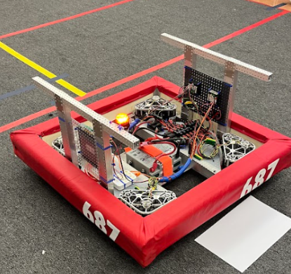
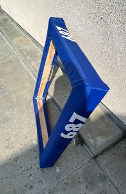
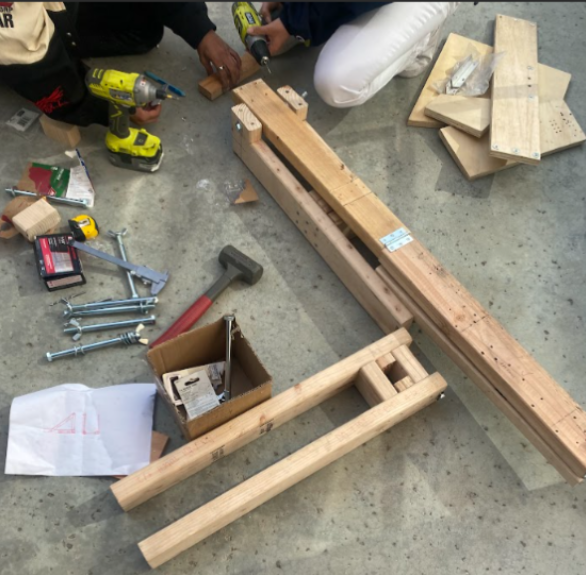

# Competition Week 6
*Week 13 (4/2 - 4/8)*

## Assembly

### 04/3 Monday 

- Retest batteries from AVR  

- Members check packing  

- Clean machine shop  

- Drive base electrical 

- Helped w new battery cart 

- Worked on Houston packing list 

- Change elevator gear ratio to 15:1  

- Change elevator motor mount screws  

- Find better way to secure motor 

 
### 04/7 Friday 

- Inventory for backup elevator 

- Got new treads for proto bot swerve module wheels 

- Finished assembling new bumpers for IS ME 




- New bumpers (red and blue)			 

- Finished electrical for proto bot 

- Tested batteries 

- Fixed a battery lead 

- Packed for Houston 

- Cleaned electrical benches 

- Made and assembled smaller foldable cone nodes to fit shipping requirements 



### 04/08 Saturday

- Went to Da Vinci
- Assemble (spare) elevator
- Clean machine shop
- Continue testing batteries 


## CAD

### 4/3 

Since we have finished Cadding our robot, we have focused on meching the robot (new bumpers, fixing flaws, adding new 3D prints, etc). 

### 4/8 

After finishing the updates to our robot, we went to a practice field in order to test our robot with other teams. 

## Programming

This week, we switched to using velocity control on our swerve drive during autos. This allows our auto timings to be more accurate.
```java
public void setDesiredState(SwerveModuleState state) {
    if (Math.abs(state.speedMetersPerSecond) < 0.001) {
        stop();
        return;
    }
    state = SwerveModuleState.optimize(state, getState().angle);
    
    desiredAngle = state.angle.getDegrees();
    
    double velocity = state.speedMetersPerSecond / ModuleConstants.kDriveTicksPer100MsToMetersPerSec / ModuleConstants.kDriveMotorGearRatio;
    this.desiredVelocity = velocity;
    
    // Toggle between velocity control and percent output
    if (this.velocityControl) {
        driveMotor.set(ControlMode.Velocity, velocity);
    } else {
        double currentPercent = state.speedMetersPerSecond / SwerveDriveConstants.kPhysicalMaxSpeedMetersPerSecond;
        driveMotor.set(ControlMode.PercentOutput, currentPercent);
    }
    double turnPower = turningController.calculate(getTurningPosition(), state.angle.getRadians());
    
    turnMotor.set(ControlMode.PercentOutput, turnPower);
}
```
