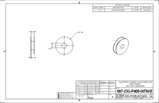

# Design

Use the links below to explore our 3 offseason robots:

- [Cube Shooter](#cube-shooter)
- [Rotation Linear (RL)](#rotation-linear-rl)
- [Linear Rotation (LR)](#linear-rotation-lr)

## Cube Shooter

### 8/21/2023

#### Drive Base:

We chose a swerve drive base because it is essential for a cube spammer to be able to quickly maneuver around the arena. A swerve drive base would enable our drivers to quickly pick up cubes anywhere on the arena. Compared to a west coast drive base, which is slow and hard to maneuver, it was clear that a swerve drive base would be a better option.

#### Intake:

We wanted an intake that could
1.	Easily pick up cubes
2.	Quickly drop cubes into the bottom row
3.	Shoot cubes into the mid and high rows

#### Hard Stop:

We designed our hard stop to hold the intake in a stowed position. The hard stop made programming the pivot a lot easier.

## Rotation Linear (RL)

### Pivot:

Pivot Idea for RL Bot:
1.	Design a pivot that can rotate and be able to rotate to reach all 3 rows, the top, middle, and bottom rows. 
2.	Pivot can rotate to reach both substations and ground to be able to pick up game pieces.
3.	Offset pivot for more extension
4.	Able to have elevator resting down
5.	Able to fit in robot and fit both the elevator and electrical.
Inspiration we used for our pivot included robots:
•	Team 1678 (Citrus Circuit)

(1678 Citrus Circuit’s Pivot) 
(When using 1678’s pivot as reference, avoid bent plate as we are unable to make that) 
First Iteration:
For the first iteration of the pivot, we based our design on 1678 just without the bent base plate as said. Dimensions that we used were 15 inches for the vertical bar and 15 inches for the horizontal bar, the horizontal bar was raised 2.5 inches. The bars were this long so that it is long enough to clear the swerve modules and it was raised to be over the swerve modules without hitting it. 

First Iteration CAD of Pivot

Second Iteration:
For our second iteration of the pivot, we shortened the horizontal bars by 3 inches as it gives more space for electrical instead of having 15 inches, now it is 12 inches. Due to the change in length, the motors more to the front instead of the back so that the swerves had enough space. The vertical bars are raised higher to allow more room for the elevator to rotate up and it creates the ability to attach the elevator to the pivot without hitting anything above or below. There’s also a new horizontal bar at the top which is a stoppage point so the elevator doesn’t over rotate. There is an extra plate there to add stiffness.  With the new horizontal bar, it serves as a mounting point for the limelight. 

Second Iteration CAD of Pivot

Limelight mounted on horizontal bar

### Elevator:

Elevator Idea for RL Bot:
1.	2 stages including the base stage
2.	Can extend 73.5 inches at most 
3.	Can score high comfortably 

The sketches show 73.5 inches of extension for the elevator and extending to the highest node of scoring. 
Inspiration we used for our elevator:
•	Is me elevator structure
•	1678 plate
First Iteration:

Second Iteration:

### Wrist

Wrist Idea for RL bot:
1.	Wrist can move 240 degrees
2.	Rotate the intake to pick up from anywhere and the purpose of scoring
3.	Rotate the intake up and down for the purpose of a cone or triangle. 
Inspiration we used for our elevator:
1.	1678 gearbox wedges

### Intake

Inspiration:
For the Intake on our RL bot, we wanted a roller intake that:
1.	Picked up Cone and Cube from the double substation.
2.	Picked up cube from floor.
3.	Pick up the upright cone from the floor.
4.	Drop Cone and Cube fast into hybrid.
5.	Able to reach both first and second stage.
6.	Stowable with both cube and cone (For getting from double substation to scoring).
7.	Able to be compatible with wrist and be efficient with the extra degree of movement.
For extra inspiration we looked at 1678 Citrus Circuit's robot's intake as well as our own design that meets our needed constraints.

Fig.1b. 687 Nerd Herd’s Intake on season

Fig.2b. 1678 Citrus Circuit's intake

First Iteration: 
For the first iteration we decided to go for a 2 Versa-Roller intake in which the cube would fit between the roller and the bar the cube would go through the two rollers. To do this there were a few things that we had to consider:

Fig.3b. First iteration intake

Fig.4b. First iteration intake drawing

Second Iteration:
After the initial design, we identified a possible issue where the third shaft could cause interference with cone intake zone. Additionally, we recognized that the existing two-roller configuration was not ideal and had difficulties picking up ground cubes effectively. To address these challenges, we made several modifications. We incorporated an extra roller and transitioned to a Versa Roller setup with rope pulleys, eliminating the need for the third shaft entirely. Furthermore, we added additional material to the side plate to accommodate a third shaft that would help with cube intaking and another shaft for cube renditioning.

Fig 5b Second iteration intake

Fig 6b Additional material was added to the side plates to incorporate a third shaft. (We determined during season that 6.90 was ideal for cube compression).

Fig. 7b. Intake default position on the robot

Fig.8b. Spacing of additional shafts

For rollers, we decided to use the Easy Drop VersaRoller example from VEXpro with a few modifications. To incorporate our pulley that connects to the Falcon 500, we duplicated the left side configuration on both sides of the roller. Additionally, we implemented the West Coast Products 1.625" pulley instead of the sprocket given in the example. When a figure-8 rope configuration is used, the pulleys will allow us to have our rollers rotate in opposite direction without needing the old third-shaft gear setup. Lastly, we also moved the pulleys inside the intake to protect it in case of collisions

Fig 9b VEXpro VersaRoller Easy Drop Example Diagram

Fig 10b WCP-0096 1.625" Pulley

Fig. 11b. Our modified VersaRoller

Fig. 12b. VersaRoller side view

## Linear Rotation (LR)

Linear Rotation elevator is a fixed elevator mounted at a fixed angle, with an intake that has a pivot point/rotational element. Benefits of this elevator include the ability to pick up toppled game pieces. There is also a benefit of being able to only worry about one fixed angle.

### 7/11/2023

We were taught how to make drawings. 

[Drawings Presentation](https://docs.google.com/presentation/d/19IUzy2auP1QZKX76tMBjKxII2MggQ54rwxNw97GmoBc/edit#slide=id.gd851afca02_1_8)

### 7/12/2023

Meeting teaching CAD members about drawings and how to make good and efficient drawings. As well as looking at other teams' videos and generating ideas.

### 8/4/2023 - Summer Workshop Day #1

Talked with manufacturing about elevator’s ability to be manufactured. 

### 8/11/2023 - Summer Workshop Day #3

Finalized elevator angle for LR

### 8/12/2023 - Summer Workshop Day #4

This is another iteration of our intake. 
### 8/18/2023
Talked to manufacturing about restrictions and modifications to CAD.
Figured out elevator rigging, power transmission, and power chain. 
Talked to programming about sensors, pitched solutions for mounting. 
New iterations of intake and elevator 

### Elevator

The Falcon 500 motor that powers the elevator’s extension is attached to a 27:1 gearbox, and then runs on a chain with 18 teeth to 12 tooth sprockets. This makes a gear ratio of (27:1 * 18:12 = 40.5:1)

[LR Elevator Calculations](https://docs.google.com/spreadsheets/d/1HuOXg_E6wWyVVrLkWfIcvPGfoEaJVjmpGlalHjqDc7U/edit?usp=sharing)

Rigging:
The rigging system of our cascading elevator uses a chain that is attached to the elevator’s second stage, which moves it up. A string that is attached to both the first stage and third stage and wraps around the second stage lifts the third stage while the second stage is lifted.  Thus, the third stage moves the same distance as the second stage relative to their starting points.

One end of the string is attached to the first stage on the crossbar. It goes up the elevator and wraps around the axle attached to the second stage, and then goes down and gets pinned down to the third stage by the gusset on the third stage. It continues down and wraps around the axle on the second stage, going back up and ending at the first stage. The reason we chose to use a cascading system instead of a continuous elevator is mainly the speed by which we get extension and the relative ease through which we can rig it.

This rigging is beneficial to us because of its relative ease to implement in our robot, as well as its higher speed in combination with being suitable to our robot’s needs.  

### Elevator iterations

This is our older version of the CAD which was much skinnier. Everything from the rigging to power was the same. The reason we went from this version to the wider version is because of the lack of space in the center to hold an intake and overall cramped workspace`. 
This is the first version of our elevator. It had all the calculations with less attention to detail specifically in the wiring and gussets. The calculations confirmed the feasibility of the design, which gave us confidence to keep going.

### Intake

We wanted our intake to be able to pick up cones and cubes from the floor and the single substation. We also wanted to be able to pick up tipped over cones. 

#### 6/13/2023

Below are pictures of the first iteration of the intake

#### 6/16/2023
CAD of intake was reviewed in a meeting call. We were informed that belts aren’t optimal for intake. We changed from belts to gears. 
#### 6/23/2023
This is a screenshot of another iteration of the intake. It was inspired by 2910, Jack in the Bot. 

#### 8/19/23
These are more iterations of the intake created by our members. 

We talked to Scott for feedback on the intake. 
#### 8/21/23
We were told that our intake had to be a max of 12x12 inches, and our intakes exceeded those limits, so we had to redesign our intakes. 

#### 8/24/23
We found out that our intakes wouldn’t work for the robot because it would go over the boundaries of the drive base. We had to make our intakes fit in between the elevator bars. We had to shorten the width of the elevator. We also had to shorten the length of the intake, so it wouldn’t go past the boundaries. 

#### 8/26/23
The elevator bars were widened, so we had more freedom with our intake and its width. 
#### 8/28/23

