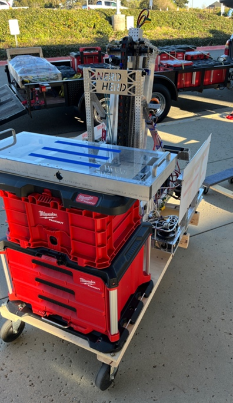
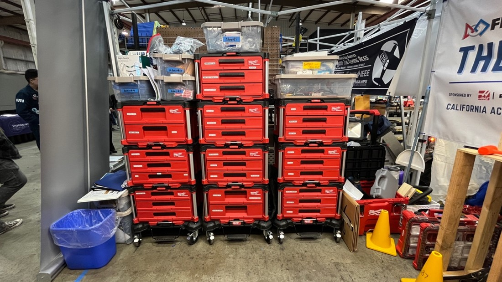
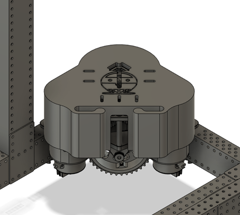
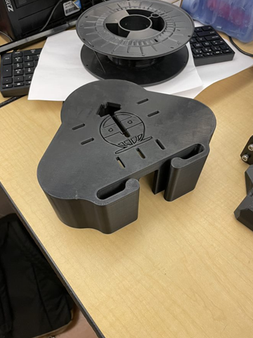

# Competition Week 1
*Week 8 (2/26 - 3/4)*

## Assembly

### 2/27 Monday

Pneumatics
- Remove pneumatics from the robot

Electrical
- Added a limit switch for the stowed position
- Switched the navX to V2
- Worked on CAN resistor

Robot Cart

- Continued assembling the new robot cart
- Completed Robot Cart Shown at Port Hueneme Regional

Motors
- Figured out the problem with the V3 Falcons

Driver Station
- Discussed driver station laptop and controller placement

Bumpers
- Took measurements of the bumper fabric for embroidery

Packing
- Worked on creating a new packing list for Port Hueneme Regional

*Packed Milwaukees at Port Hueneme Regional*

## CAD

### 2/27 

*CAD of the swerve cover v4.5*

Introducing... swerve cover version 4.5! Featuring zip tie holes for wire management, this design is sure to win the day! 

*Printed swerve cover v4.5*

The print failed though... Guess we’ll have to redesign to accommodate this! 

In addition, today we decided we wanted to improve our design for the robot cart. We successfully finished our CAD for our newly designed robot cart. 

## Manufacturing

## Programming

This week, we cleaned up our code in preparation for the Port Hueneme Regional. We also tested our autos and finalized our charge auto for the competition, fixing an issue with our NavX orientations. 
We also tuned our arm and elevator motion magic code, refining our substation intake, ground intake, and low, middle, and high scoring postions. We also updated and printed our software binder in preparation for the competition.

At the competition, we branched off our codebase into a separate branch. We discovered several issues at the competition, such as unreliability with our limit switch and charge auto. After the competition, we released our code as [version 1.0.0](https://github.com/nerdherd/ChargedUp2023/releases/tag/v1.0.0).

### Vision

Using our amazing limelights, we got our object detection to work on both gameobjects and scoring landmarks. Using this revolutinary technology of ours, we had the ability to drive to, pick up, and score either cones or cubes on the grid. A total of 4 pipelines were used to detect cone, cube, reflective tape, and april tag contours.

We
-Organized / packed for comp​
-Ensured all limelights are labeled correctly
-Debugged vision command sequence​
-Updated limelight config​