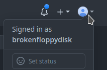
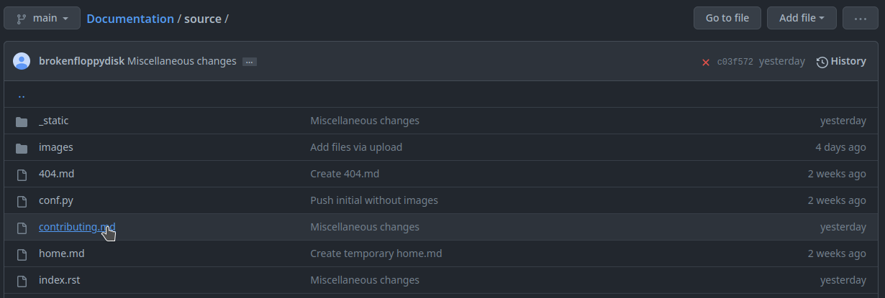
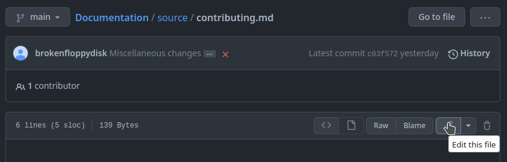
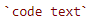
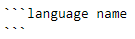
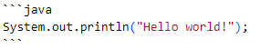
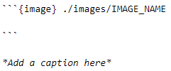
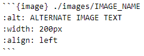
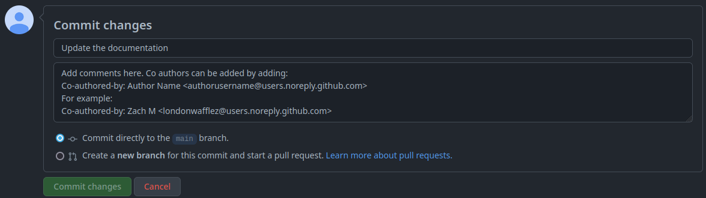

# Contributing

## Navigating the Repository

First, open the [github repository](https://github.com/nerdherd/documentation) in a web browser.

Your account must be a part of the [nerdherd Github organization](https://github.com/nerdherd) 
in order to edit the repository.
To be invited, please contact a programming subteam member.



*Checking your login on the top right of the page*

Then, click on the [`source` folder](https://github.com/nerdherd/Documentation/tree/main/source) to see the markdown files for each page.


*The source folder*

## Editing pages

To edit a page, find its corresponding markdown (.md) file 
and click on the edit button to start editing.



*Finding the markdown file*



*Entering edit mode*


*The editor interface*

You can click on `Preview` to see a sample version of your document.

## Basic Syntax

For a full guide on markdown, see the [MyST Parser documentation](https://myst-parser.readthedocs.io/en/latest/syntax/syntax.html).

### Headings

Pages should always start with an h1 heading, which is created with:
```md
# Heading name
```

Subheadings can be made by adding more hashes:
```md
## Subheading name
### Smaller subheading name
#### Even smaller subheading name
```

Try to avoid skipping more than one heading level at a time.

### Text formatting

To **bold** text, do:
```
**text to bold**
```

To *italicize* text, do:
```
*text to italicize*
``` 

Please italicize image captions.

To ***bold and italicize*** text, do:

```
***text to bold and italicize***
```

### Code Blocks

To format text as `monospace` (code, filenames, etc.) do: 




To format an entire section as code, do:




If you want the code to be highlighted, replace `language name` with the language name.

For example, this code block



outputs

```java
System.out.println("Hello world!");
```

### Adding links

To add a link as text, follow this syntax:
```
[Link text](https://website-name.com)
```

To add a link directly, do:
```
<https://website-name.com>
```

### Adding Images

To add an image, first upload an image in the [`/source/images` directory](https://github.com/nerdherd/Documentation/tree/main/source/images).

Then, to embed the image in a document, add:

```md


*Add a caption here*
```

or



You can change the image's size and other properties by doing:



For more information, see the [MyST Parser](https://myst-parser.readthedocs.io/en/latest/syntax/optional.html#html-images) documentation.

## Saving Changes

To save your changes, scroll to the bottom of the editor, write notes, and press "Commit changes."

If someone worked on the page with you, add them as a co-author by adding to the commit message:
```
Co-authored-by: AUTHORNAME <USERNAME@users.noreply.github.com>
```

For example, to add [Zachary Miller](https://github.com/londonwafflez) as a co-author, add:
```
Co-authored-by: Zach M <londonwafflez@users.noreply.github.com>
```



After a few seconds, your changes will be built and displayed here on the [website](https://nerdherd.github.io/Documentation/).

## Adding New Pages

To add a new page, create a markdown file for it in the `source` [folder](https://github.com/nerdherd/Documentation/tree/main/source).

Then, add it to the table of contents in [index.rst](https://github.com/nerdherd/Documentation/tree/main/source/index.rst) for it to appear on the website.

```rst
.. toctree::
   :maxdepth: 1
   :caption: About:

   PAGE NAME <./PAGE_FILE.md>
   PAGE 2 NAME <./PAGE_2_FILE.md>
```

Make sure that there is an empty line between the `:caption:` line and the first page name.

You can add additional `toctree`s to add more sections on the sidebar.


