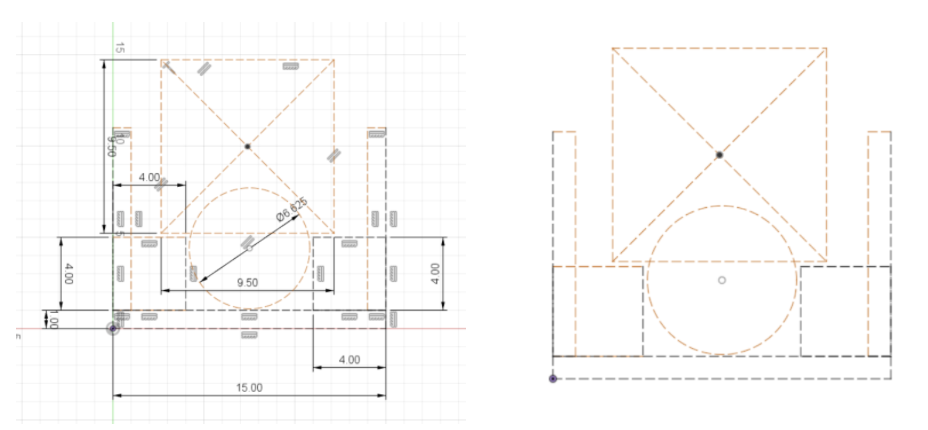
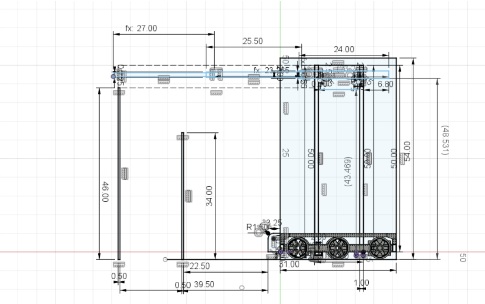
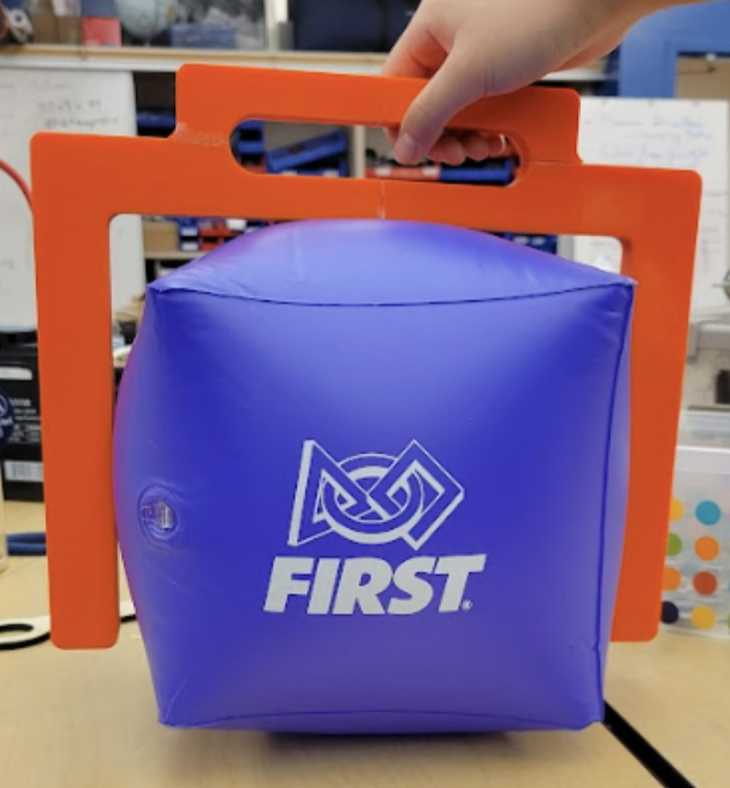
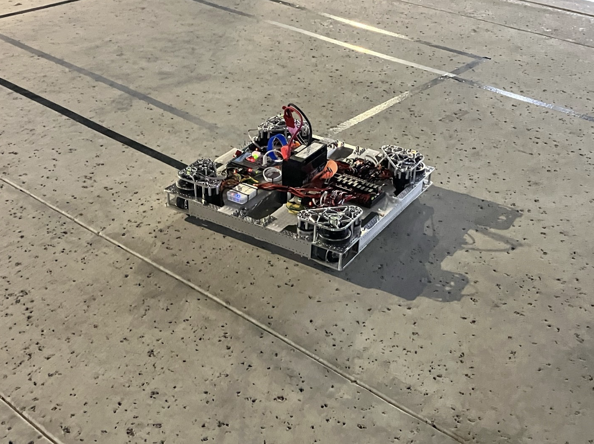

# January 7th Meeting

## Kickoff

We decided that we wanted to start the season strong by doing Robot in 3 Days. On the first day, we started out by watching the livestream and coming up with robot and gameplay strategy. Afterwards, we mainly focused on design the first iteration of our robot and building the game elements.

**Schedule:**

* 8:30 am - 9 am: Leads setup rooms and livestream 

* 9 am - 10 am: Watch livestream 

* 10 am – 12 pm: Game manual breakdown, strategy, setting goals, robot sketches 

  * 30 min game manual

  * 15 min goal setting in big group

  * 35 min small group brainstorm about strategy and robot 

  * 30 min big group brainstorm - Each group says a 60 second elevator pitch of their idea and use Pugh analysis to decide: https://sixsigmastudyguide.com/pugh-analysis/  

* 12 pm - 1 pm: Lunch (Potluck) 

* 1 pm - 3:30 pm: CAD / Assembly (field elements)  

* 4pm - 7 pm: CAD / Assembly (field elements) 

* 7pm – 7:30: Dinner 

* 7:30 pm - 10:30 pm: Manufacturing / Assembly (field elements) 

*****

## Assembly

We used the field drawings and Read Me documents for the official field elements on the [FIRST website](https://www.firstinspires.org/robotics/frc/playing-field). We decided to make the middle/end cone ramps, cube shelf, and the half charge station and bought all of the materials listed on each of the Read Me documents. We split our Assembly subteam into 3 groups; the middle cone ramp, the cube shelf, and the charge station. Using the “example cut list” on the Read Me documents, we measured everything onto the sheets of plywood and pieces of lumber for each field element. Each group cut everything out with the circular saw, bandsaw, and the hacksaw.  

*Note: got all materials and started measuring and cutting (no assembly)*

*****

## CAD

### Claw Intake

We wanted to incorporate four contact points with four wheels attached to four gears. We created a crayola CAD of our design and prototype with VEX parts.

#### Design #1

*Crayola CAD of Claw Intake*

*Prototype of Claw Intake*

Design Matrix:
| Strengths               | Weaknesses   |
| ----------------------- | ------------ |
| 4 contact points        | 1 motor      |
| Secure / strong         | Heavy        |
| Easy to program         | Wire routing |
| Requires less precision |              |

We also created another design, a linear actuator claw.

*Crayola CAD of Linear Actuator Claw*

*Prototype of Linear Actuator Claw*

Design Matrix:
| Strengths                         | Weaknesses          |
| --------------------------------- | ------------------- |
| No Motor                          | Needs to be precise |
| Lightweight                       |                     |
| Easier to program                 |                     |
| Carries both position and control |                     |

### Lift Mechanism

We made a Crayola sketch of the linear and linear, elevator and telescope. We wanted to see if it was possible to reach both height and length of the highest node. It was possible, but it would be very close.  

We decided to make the elevator on the side. We took inspiration from [this design](https://www.youtube.com/watch?v=Yp3l5F0qt8I), and I wanted to make it sideways for more point of contact in the telescope as shown below.
  

*Crayola CAD of Lift*

### Arm

placeholder

*****

## Manufacturing

On the first day of RI3D, the manufacturing subteam CADed the measurement jig using the CAD drawings provided on the FRC website. We printed the cube measurement jig with the same weight (563.308g) as the one used at competition using density calculations. 

*3D Printed Cube Jig*

Some of the manufacturing members assisted assembly with the swerve drive BOM. We discussed what parts of the swerve drive could be manufactured and which parts should be purchased. 

We also assisted with the field element assembly after completing the cube measurement jig. This included measuring the wood to cut and band sawing them for the next day. 

*****

## Programming

We made a [new repository for 2023](https://lbschools-my.sharepoint.com/:v:/g/personal/201208373_lbschools_net/EaC1TMrnCDlEpV02tHjvrBQBVoQQI92frhdzuIT3KPlBxw) and began writing the Drivetrain subsystem, as well as the auto using tank drive. 

### Vision, Arm, and Elevator

We specifically aimed to setup testbenches to run Limelights to detect AprilTags and reflective tape. With the help of our mentors, we based the design of our testbench off the following diagram:
  

*Diagram of testbench setup* 
 
Then, we made several modifications to our testbenches such as supplying power to the RoboRIO after wires were disconnected, and updating RoboRIO firmware.

  
*RoboRIO re-imaging process*
 
For AprilTag recognition, we decided on the [PhotonVision Limelight image](https://docs.photonvision.org/en/latest/docs/getting-started/installation/sw_install/limelight.html) as it included built-in support. However, after installing drivers onto the Limelight and imaging the Limelight using Balena Etcher, we discovered the hardware we were using was stuck in a boot loop. As we would not have access to new Limelights until tomorrow, we moved on to developing baseline code for our subsystems. 

Because we are currently split among two drive bases: swerve and west coast, we decided to use a repository with an arm and elevator subsystem (two subsystems in common among all versions of code) as our main branch. The latest commit can be found [here](https://github.com/nerdherd/ChargedUp2023/commit/387af596c2bf5fcec82245eb6617aae20f59fdf3). 
 
### Swerve Drive

Today, we decided to work on programming our swerve drive system to test its feasibility in competition. We were able to get our drivebase to work with the help of our mentors, and may be considering using a similar design for our competition robot this season, if we are able to find parts to repair the drivebase when necessary.

*Swerve Drivebase*
  
### Autonomous Pathing
 
* First, our group came up with possible autonomous paths for our robot. The paths we came up with in order of development are: 
* Park on the charging station without it being level. 
* Park on the charging station and make it level. 
* Score a single preloaded cone and leave the community. 
* Score a single preloaded cone and park on the charging station to make it level. 
* Score a preloaded cone onto one of the side nodes, leave the community to pick up another cone from the playing field, and return to the community to score it in the hybrid node. 
* Score a preloaded cone onto one of the side nodes, leave the community to pick up another cone from the playing field, return to the community to score it in the hybrid node, and dock on the charging station to make it level. 

We decided to focus on a path for docking and engaging on the charging station, as well as another path for scoring one preloaded cone onto one of the side nodes. We found the coordinates for these paths using the dimensions given on the drawings and game manual. 
