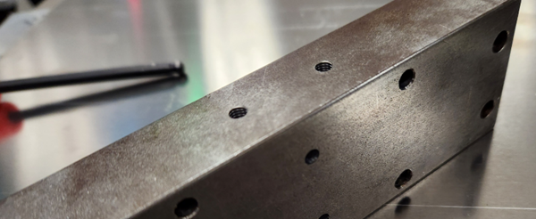
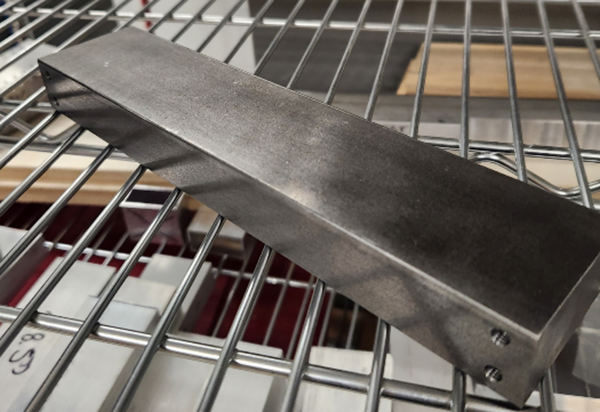
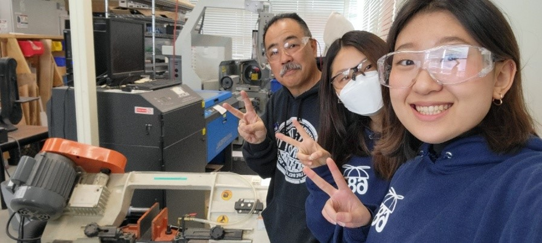
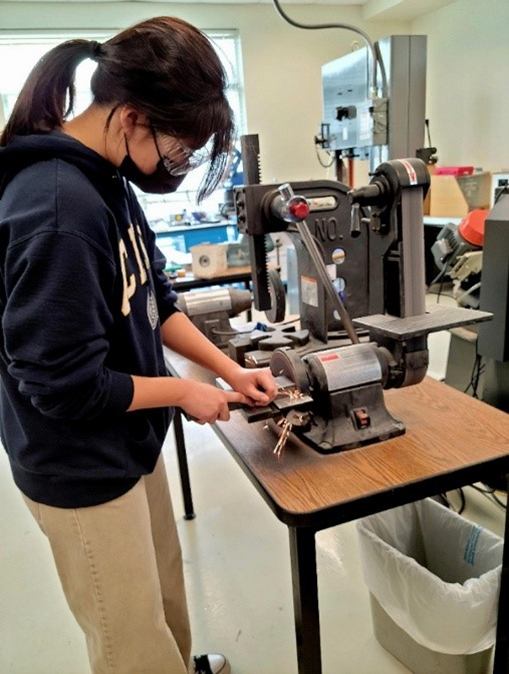
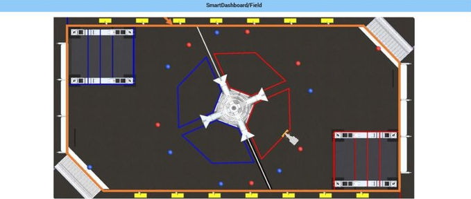
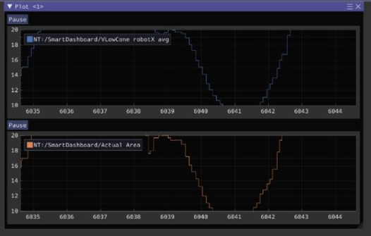

# Week 6 (2/12-2/18)

```{admonition} Under Construction
This page is currently under construction. Please return later for more updates.
```

## Assembly

## CAD

### 2/13/2023

Worked with assembly on electrical components

- Mounted compressor
- Remounted back electrical channel

### 2/17/2023

Made scouting form for real comp


*Our Technical Data Package*

Much 3d printing happened today. We printed a spacer for the third stage of the elevator and 3d printed another spacer for the battery. We also installed a limit switch for the rotation part of the elevator and started a CAD for the limelight mount. Also, we started working on the technical data package. We redid some swerve drive drawings in order to do this.

### 2/18/2023

Worked with assembly on robot cart

## Manufacturing

### 2/13 

The drilling and tapping operations were tested on a steel brick. These operations will be used for the steel weights on the robot. 



### 2/15 

We were in the process of cutting steel stock for manufacturing steel bricks that would help balance the weight of our robot, but after cutting 5 pieces, the horizontal bandsaw experienced problems with the blade falling off the pulley. Ways to fix this were brainstormed, and we decided to experiment with changing the speed of our vertical bandsaw to cut the steel. Although one blick was cut this way, we decided to return to the horizontal bandsaw with different speeds the next meeting. 



### 2/17 

The horizontal bandsaw was readjusted for speed and tension, and once its changes were shown to be effective, it was documented. 4 more steel bars were then made, and two were drilled and tapped for installation. 

### 2/18 

After trimming some steel bricks down to the necessary size and sanding, we finished one more brick. However, while machining, our chamfer spot drill became chipped. After this occurred for the third time, we decided to put steel bricks on hold, which proved to be a good decision as there were issues with installing the steel bricks with enough clearance to avoid hitting our bumper pins when they were removed. There were also some technical difficulties with our work probe on the TM-1, which resulted in some delay. 



*Our horizontal bandsaw cutting steel, featuring our recently Woodie Flower nominated manufacturing mentor!*



*Our MFG lead bravely sanding steel (sparks are not that fun, guys)*

## Programming

-We added code for the elevator to the Constants, RobotContainer, Arm, and elevator folder. We updated the CANSwerveModule by switching to directly reading from CANCdoer for angles. We also tuned the encoder offsets for our CAN Swerve Modules.

For our superstructure, we separated our arm and elevator into separate classes to make programming them easier. We also updated our feed forward values and calculations. We also added code for limit switches, allowing us to reliably set our stow position. This stops our pivoter from overshooting. We also added buttons for resetting the encoders of both subsystems in the superstructure to make testing simpler.

For our swerve drive, we created simulations to test our dodge mode and allow our drivers to experiment with our drive filters. 



*Swerve simulations for driver input tuning*

We also abstracted our filters into separate Filter classes sharing an interface, making it easier to apply different filters. This allowed us to create a more complex filter pipeline without adding a lot of extra code to our SwerveJoystickCommand class. We then separated out this code into a new repository, [NerdyFilters](https://github.com/nerdherd/NerdyFilters). 

```java
Filter driveFilter = new FilterSeries(
    new DeadbandFilter(deadband),
    new WrapperFilter(
        (x) -> {
            if (x == 0) {
                belowDeadband = true;
                return 0.0;
            } 
            if (x > 0) {
                belowDeadband = false;
                return x - deadband;
            } else {
                belowDeadband = false;
                return x + deadband;
            }
        }
    ),
    new ExponentialSmoothingFilter(alpha),
    new PowerFilter(3),
    new WrapperFilter(
        (x) -> {
            if (belowDeadband) return 0.0;
            else {
                return Math.signum(x) * ((Math.abs(x) / deadbandScaler) + motorDeadband);
            }
        }
    ),
    new WrapperFilter(
        (x) -> {
            return Math.signum(x) 
                * slewRateLimiter.calculate(Math.abs(x));
        }
    ),
    new ScaleFilter(scale),
    new ClampFilter(scale)
)
```

*Our filter pipeline*

For vision, we measured optimal mounting heights and angles for our limelights. Additionally we tried out using PhotonVision, as it makes cone detection less noisy, when in combination with a rolling average filter.



*Reading vision values in Glass*
